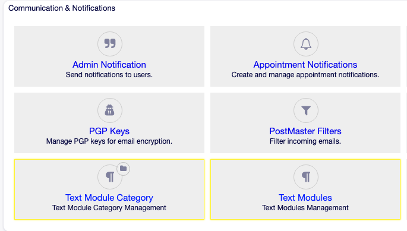
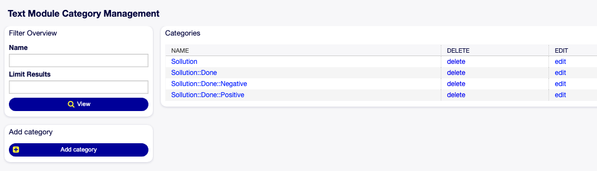
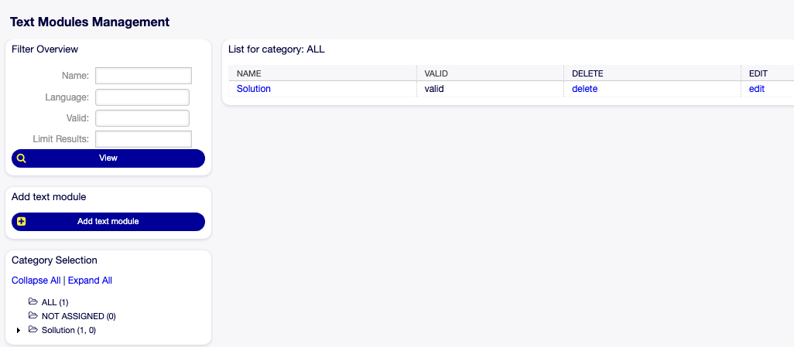
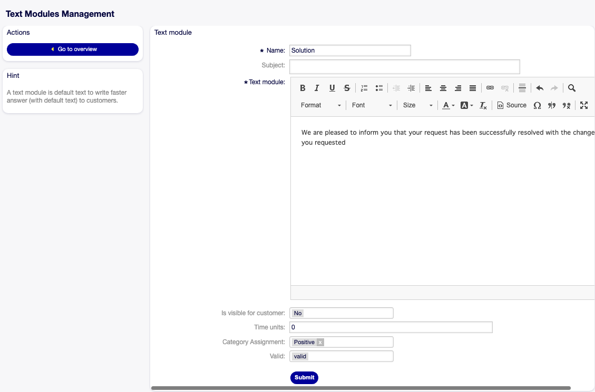
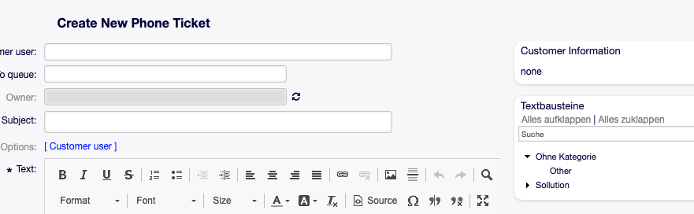

# Text Modules

The Addon TextModules provides the possibility to use predefined text snippets in input forms within categories. 
These text snippets are frequently used and can therefore be used in a standardized manner.

## Install
- Just install the opm as usual. 🥱

## Configuration

### Administration Overview

*Figure 1 - Settings in admin overview section*

### Text Modules Category

*Figure 2 - Category Management*

You can add, edit or delete categories. The filter on the left can be used
to find a specific category by name.

### Text Modules

*Figure 3 - Text Modules List*

You can add, edit or delete modules. Widgets on the left can be used to find
existing modules easier by filtering or using the tree view.

#### Editor

*Figure 4 - Text Module Editor*

The text modules can be used to add an information to the subject and/or the body
of a message. The body is always mandatory.
Additional settings are: 

- Is Visible for customer
- Time Units
- Category Assignment
- Validity of the text module

*Figure 5 - Modules without category*

If no category assignment is chosen, the text module can be found in "Without Category" (Figure 5 - Widget on the right)

