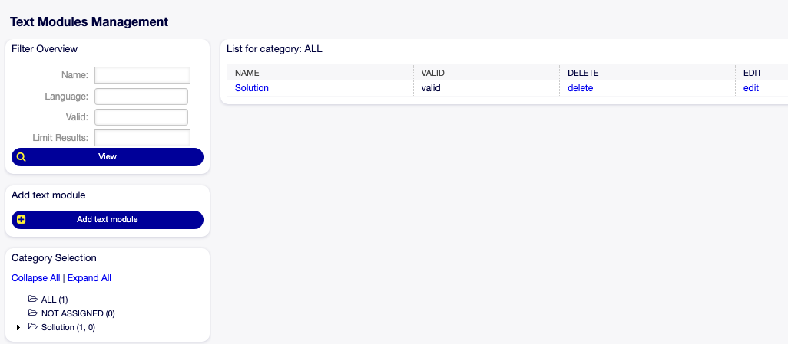

# Text Modules

Das Add-On "Text Modules" bietet die Möglichkeit, vordefinierte Textbausteine in Eingabeformularen innerhalb von Kategorien zu verwenden. 
Diese Textbausteine werden häufig verwendet und können daher standardisiert eingesetzt werden.

## Installation
- Installieren Sie einfach das Add-On wie gewohnt.

## Konfiguration

### Administrationsübersicht

*Abbildung 1 - Einstellungen im Administrationsbereich*

### Kategorien für Textbausteine

*Abbildung 2 - Kategorieverwaltung*

Sie können Kategorien hinzufügen, bearbeiten oder löschen. Der Filter auf der linken Seite kann verwendet werden,
um eine bestimmte Kategorie nach Namen zu suchen.

### Textbausteine

*Abbildung 3 - Liste der Textbausteine*

Sie können Textbausteine hinzufügen, bearbeiten oder löschen. Widgets auf der linken Seite können verwendet werden, um
vorhandene Bausteine einfacher zu finden, indem Sie filtern oder die Baumansicht verwenden.

#### Editor

*Abbildung 4 - Textbaustein-Editor*

Die Textbausteine können verwendet werden, um Informationen zum Betreff und/oder Inhalt einer Nachricht hinzuzufügen.
Der Inhalt ist dabei immer ein Pflichtfeld.
Zusätzliche Einstellungen sind:

- Sichtbarkeit für den Kunden
- Zeiteinheiten
- Kategoriezuordnung
- Gültigkeit des Textmoduls

*Abbildung 5 - Bausteine ohne Kategorie*

Wenn keine Kategoriezuordnung ausgewählt wird, kann der Textbaustein unter "Ohne Kategorie" gefunden werden (Abbildung 5 - Widget auf der rechten Seite).
